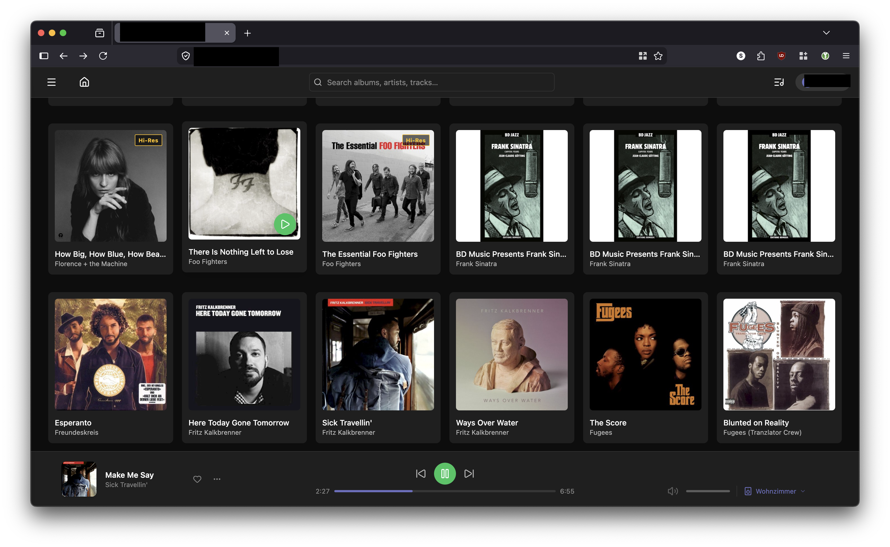

# Audiotheque

> Self-hosted high-resolution music streaming. Browse your collection from any browser, sync playback across every tab and device in real time, and transfer playback to MPD speakers around the house — like a personal Spotify running on your own hardware.

[](https://github.com/klabast/audiotheque/actions/workflows/ci.yml)
[](LICENSE)


> [!WARNING]
> **Audiotheque is built with heavy AI assistance (Claude Code).** The code is
> human-reviewed and runs on its author's hardware, but it is a hobby project
> and there will be rough edges. **Don't run it anywhere uptime matters.**
> Bug reports and PRs are welcome.

## What it does

- **Stream your own music** to any browser — FLAC, ALAC, MP3, OGG, hi-res.
- **Multi-device sync, Spotify-style.** Open the app in five tabs; pause in one and the rest pause too.
- **Transfer playback to MPD speakers** around the house, with auto-discovery via mDNS.
- **Self-hosted.** Your library, your network, your data.

## Screenshots



_Library view, dark theme. Playback footer shows the current track streaming
to the "Wohnzimmer" MPD speaker — the seek position ticks live as the server
polls MPD and pushes state over WebSocket to every connected tab._

## Quick start (Docker)

```bash
# Edit docker-compose.yaml to point at your music folder, then:
docker compose up -d
```

The app comes up on `http://localhost:8080`. First-time visit opens a setup
wizard to create your admin account.

See [Install](#install) below for the full configuration surface.

## Status & scope

| Works | Mostly works | Known rough edges |
|---|---|---|
| FLAC / ALAC / MP3 / OGG playback | MPD multi-room | No mobile apps (web only) |
| Library scan with cover art | mDNS device discovery | No playlists or favourites yet |
| Multi-tab/device sync | Hi-res passthrough | Queue ops are REST, not WS |
| First-run setup wizard | Stream-to-MPD URLs | Single SQLite connection — fine for personal scale, not multi-tenant |
| HttpOnly cookie auth, Argon2id hashing | | Offline sync planned but not built |

This is a **single-household, single-author hobby project**. It's not trying
to replace Navidrome, Jellyfin, or Plex, and it isn't going to grow a
plugin ecosystem.

## Why another music server?

Most self-hosted music servers either treat playback as a per-device thing
(open the app on the phone, it's a different "session" from the browser) or
go all-in on classical-library metadata. Audiotheque is the simple thing
in the middle: **one logical playback session per user**, synced over
WebSocket, transferable to any tab or MPD device in one click. That's it.
That's the pitch.

## Stack

- **Backend** — Go, SQLite (`modernc.org/sqlite`, pure Go — no cgo), embedded SvelteKit static bundle.
- **Frontend** — SvelteKit with Paraglide i18n, UnoCSS (Tailwind-compatible utility classes via `presetUno`).
- **Audio** — FFmpeg for transcoding, file metadata via `taglib` shell-outs.
- **Discovery** — mDNS for MPD speakers on the LAN.
- **Auth** — HttpOnly cookies + Argon2id; signed short-TTL JWTs for MPD stream URLs.
- **CI/CD** — Dave Farley-style pipeline: commit → image → acceptance → promote.
  Trunk-based; pull requests run acceptance, so `main` stays releasable.

## Install

### Docker (recommended)

```bash
git clone https://github.com/klabast/audiotheque.git
cd audiotheque
# Edit docker-compose.yaml: set the bind mount for your music folder
# and (optionally) your MPD hosts in environment.
docker compose up -d
```

### From source

**Prerequisites:** Go 1.26+, Node 20+, FFmpeg.

```bash
# Backend
cd server
go build -o audiotheque ./cmd/server

# Frontend (embedded into the binary via go:embed)
cd ../ui
npm ci && npm run build

# Run
./server/audiotheque
```

### Configuration

All configuration is via environment variables. Sensible defaults make most
of them optional.

| Variable | Purpose | Default |
|---|---|---|
| `AUDIOD_PORT` | HTTP port | `8080` |
| `AUDIOD_DATA_DIR` | DB, cache, reset codes, transcode cache | `./data` |
| `AUDIOD_WEB_DIR` | Override the embedded SvelteKit static bundle (mostly for development) | embedded |
| `AUDIOD_ALLOWED_ORIGINS` | CORS / WebSocket origin allowlist (comma-separated) | same-origin only |
| `JWT_SECRET` | Signing secret for auth cookies + stream URLs | auto-generated at startup |

Env var names use the `audiod` internal-daemon prefix (like `mpd`,
`pulseaudio`) — decoupled from the user-facing brand so renames don't
break existing installs.

MPD hosts and mDNS discovery are configured **in the UI** (Settings →
Devices), not via environment variables — they live in the database
alongside other user settings.

First-time setup: open the URL, create an admin account, point it at your
music library in Settings, trigger a scan.

## Development

See [`CONTRIBUTING.md`](CONTRIBUTING.md) for the dev workflow, test layout,
and code style. Quick start:

```bash
# Backend hot-reload
cd server && go run ./cmd/server

# Frontend dev server (proxies API calls to backend)
cd ui && npm run dev
```

Backend tests:

```bash
cd server && go test ./...
```

Frontend tests:

```bash
cd ui && npm test       # vitest unit tests
cd e2e && npm test      # cucumber + playwright E2E
```

The full CI/CD pipeline is in [`.github/workflows/ci.yml`](.github/workflows/ci.yml).

## Roadmap

The honest version: this is built around what the author personally wants. PRs
welcome for anything below, but no commitment to ship.

- [x] HttpOnly cookie auth, Argon2id hashing
- [x] WebSocket real-time playback sync across tabs/devices
- [x] MPD integration with mDNS auto-discovery
- [x] Spotify-style "transfer playback" UX
- [x] Hi-res passthrough (FLAC/ALAC native)
- [ ] Queue operations over WebSocket (currently REST)
- [ ] Playlists and favourites
- [ ] Mobile apps (iOS/Android)
- [ ] Offline sync
- [ ] Chromecast / DLNA / UPnP

## Acknowledgements

Built on the shoulders of:

- [Go](https://go.dev) · [SvelteKit](https://kit.svelte.dev) · [SQLite](https://sqlite.org) · [modernc.org/sqlite](https://gitlab.com/cznic/sqlite) · [FFmpeg](https://ffmpeg.org) · [MPD](https://musicpd.org) · [Goose](https://github.com/pressly/goose) · [Argon2](https://github.com/P-H-C/phc-winner-argon2) · [Paraglide](https://inlang.com/m/gerre34r/library-inlang-paraglideJs)

A lot of the code was written in collaboration with [Claude Code](https://claude.com/claude-code)
(Anthropic). Every change is human-reviewed, but the volume of code shipped
per hour would not have been possible solo. Bugs are mine, not theirs.

## License

[GNU Affero General Public License v3.0](LICENSE) (AGPL-3.0-or-later).

Plain English: you can use, modify, fork, and self-host this freely. If you
**run a modified version as a network service**, you must make your source
available to your users under the same license. That's the deliberate
choice — it lets the project stay open without giving any cloud provider a
free path to closed-source commercialization.
